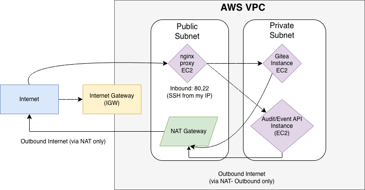

# Deploy Gitea in a Custom VPC with Multiple EC2 Instances

Sandeep Shiraskar  

---

For this , we have used the following:

- VPC: 10.0.0.0/16
- Public subnet: 10.0.1.0/24 → contains nginx reverse proxy EC2 (only instance with public IP).
- Private subnet: 10.0.2.0/24 → contains Gitea EC2 and FastAPI audit/event API EC2, no public IPs.
- Internet Gateway (IGW) attached to VPC.
- NAT Gateway in public subnet, used by private subnet’s route table for outbound internet.
- Security groups:
  - sg-nginx-public for nginx (ports 80, 22 from your IP only).
  - sg-backend-private for both backends (ports 22, 3000, 5000 from nginx SG only).

---

## PART 1: Create VPC and Subnets 

### 1.1.
I created a custom VPC (assignment4-vpc) with CIDR 10.0.0.0/16.  

---

### 1.2.
The VPC has a public subnet (10.0.1.0/24) and a private subnet (10.0.2.0/24) in the same AZ, matching the recommended CIDR blocks.  

---

## PART 2: Internet Gateway and NAT Gateway

### 2.1.
Created and attached an Internet Gateway (assignment4-igw) to the VPC to allow the public subnet to reach the internet.  

---

### 2.2.
A single NAT Gateway (assignment4-nat) in the public subnet gives the private instances outbound internet access without exposing them directly.  

Because NAT Gateways incur hourly and data-processing charges, we should delete the NAT Gateway as soon as all private-instance tests are complete to avoid unnecessary cost. This may be done in the later steps.  

---

## PART 3: ROUTE TABLES

I created the public route tables with Internet Gateway target and private route table with NAT gateway target.  

The public route table sends 0.0.0.0/0 traffic to the Internet Gateway, while the private route table sends 0.0.0.0/0 traffic to the NAT Gateway. This lets the proxy instance be publicly reachable and lets the private instances reach the internet only via NAT.  

---

## PART 4: SECURITY GROUPS

Created the nginx public security group with sg-nginx-public (Public nginx reverse proxy)  
And the backend security group sg-backend-private (gate + audit api).  

  

I created two security groups: sg-nginx-public exposing ports 80 and 22 (SSH only from my IP) to the internet, and sg-backend-private that allows ports 22, 3000, and 5000 only from the nginx security group. No backend port is open to 0.0.0.0/0.  

---

## PART 5 : Launch EC2 Instances 

The deployment uses three EC2 instances: a public nginx proxy instance in the public subnet and two private backend instances (Gitea and audit/event API) in the private subnet without public IPs.  

  
  

---

## PART 6: SSH ACCESS (Local PC -> nginx->backends)

### 6.1:
Connect to the environment from the PC using SSH to the public nginx instance, which served as a jump host for accessing the private backend instances.  

---

### 6.2:
SSH access to the private instances is only allowed from the nginx security group. I used the nginx host as a jump server to reach Gitea and the audit/event API via their private IPs.  

---

## PART 7:

### 7.1. nginx instance – install nginx and curl test

On the nginx instance I installed nginx via apt and verified that port 80 was publicly reachable by loading the default nginx page from my laptop.  

---

### 7.2. Gitea backend – install Docker and run Gitea

  

Gitea runs as a Docker container on the private backend instance, listening on port 3000 and storing its persistent data in a bind-mounted directory under ~/gitea-data.  

---

### 7.3 Audit/Event API backend – FastAPI app with logging

The audit/event API is a FastAPI service on port 5000 exposing GET /api/health, GET /api/events, and POST /api/events. A middleware logs each request to api.log including timestamp, method, path, status code, client IP, and a truncated body for POST requests.  

---

## PART 8 - Configure nginx reverse proxy (path routing)

The nginx reverse proxy listens on port 80 and uses path-based routing: / is forwarded to the Gitea backend on port 3000, and /api/ is forwarded to the audit/event API backend on port 5000 using their private IP addresses.  

---

## PART 9 - Validation and screenshots (matches checklist)

### 9.1. Internal connectivity: nginx → backends

  

From the nginx instance I successfully curled the Gitea HTTP interface on port 3000 and the audit/event API endpoints on port 5000 using their private IPs.  

---

### 9.2. External access through proxy

  

From my laptop I verified that Gitea and the audit/event API are reachable through the nginx proxy’s public IP. Gitea loads in the browser at /, and the API responds at /api/health and /api/events using curl.  

---

### 9.3. Confirm logging for audit/event API

You should see log entries for your GET and POST requests with timestamp, IP, path, status, etc.  

The audit/event API logs every request to api.log, including timestamp, HTTP method, request path, status code, client IP, and a truncated request body for POST /api/events.  

---

### 9.4. Prove backends are not directly reachable from internet

The backend Gitea and audit/event API instances have no public IP addresses, and direct curl attempts from my laptop to their private IPs fail, demonstrating that they are not directly reachable from the public internet.  

---

### 9.5. Confirm private instances have outbound internet via NAT

From a private backend instance I successfully reached external HTTPS endpoints and Ubuntu package repositories, confirming that outbound traffic flows through the NAT Gateway.  

---

## PART - 10

### Architecture Diagram 

---

## Short summary :

The architecture consists of a custom VPC (10.0.0.0/16) with a public subnet (10.0.1.0/24) and a private subnet (10.0.2.0/24). The public subnet hosts an nginx reverse proxy EC2 instance and a NAT Gateway, while the private subnet hosts separate EC2 instances for Gitea and the FastAPI audit/event API.  

The public route table sends 0.0.0.0/0 to the Internet Gateway so the proxy is reachable from the internet, and the private route table sends 0.0.0.0/0 to the NAT Gateway so the backend instances can reach the internet for package installation without being publicly exposed. Security groups enforce least-privilege: the nginx instance only opens HTTP (80) to the world and SSH (22) from my IP, and the private instances only allow ports 22, 3000, and 5000 from the nginx security group.  
